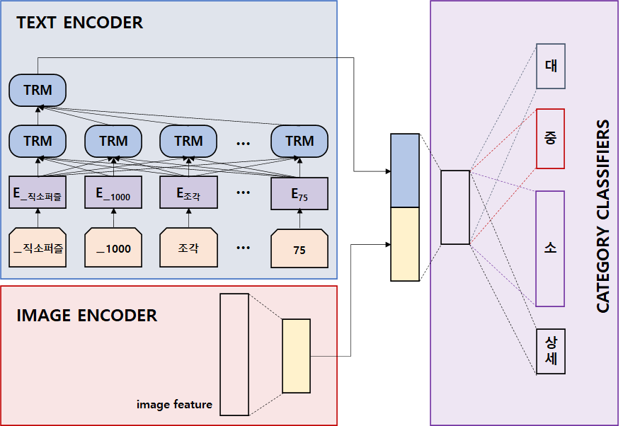

# 상품 카테고리 분류기

[카카오 아레나 - 쇼핑몰 상품 카테고리 분류 대회](https://arena.kakao.com/c/1)에 참여해 1등의 성적을 거둔 라임로봇의 오픈소스입니다. 
본 분류기는 상품명(product 컬럼)과 이미지 특징(img_feat 컬럼)을 입력으로 사용하여 대/중/소/세 카테고리를 예측합니다. 
상품명을 인코딩 하기 위한 인코더로 최근 뜨거운 관심을 받고 있는 트랜스포머 아키텍처를 사용했습니다. 
인코더로 LSTM을 사용한 버전은 다음의 [링크](https://github.com/lime-robot/product-categories-classification)를 확인해 주세요.




### 참고 - 주요 성능 향상 방법
예측 성능을 향상 시키기 위해서 세그먼트 임베딩을 활용하였습니다. 


## Requirements
Ubuntu 18.04, Python 3.7, pytorch 1.6.0에서 실행을 확인하였습니다.

CPU 코어 4개 / 메모리 16G / GTX1080 8GB / 저장공간 180GB의 최소 사양이 필요합니다. 

필요한 패키지는 아래의 명령어로 설치할 수 있습니다.
```bash
pip install -r requirements.txt
```

## Getting Started

### Step 1: 소스코드 다운로드

임의의 작업 디렉터리 아래에 소스코드를 다운로드 받습니다. 
```
~/workspace$ git clone https://github.com/lime-robot/categories-prediction.git
```

### Step 2: 데이터 다운로드

다운로드 받은 코드 하위 `input` 디렉터리에 `raw_data` 디렉터리를 생성하고, [카카오 아레나 - 쇼핑몰 상품 카테고리 분류 대회의 데이터](https://arena.kakao.com/c/1/data)를 다운로드 받습니다. 
약 90GB 정도의 저장 공간이 필요합니다.

```
categories-prediction/
├──input
│  └── raw_data/
│     ├── train.chunk.01
│     ├── train.chunk.02
│     ├── train.chunk.03
│     ├── ...
│     └── test.chunk.01
```

### Step 3: 데이터 전처리
raw_data를 전처리하여 학습에 사용이 가능한 형태로 변환합니다. 컴퓨터 사양에 따라서 약 10~20분 정도의 시간이 소요됩니다.
대회에서 제공한 데이터셋인 학습셋(Train set), 데브셋(Dev set), 테스트셋(Test set)을 전처리하여 저장합니다.
약 90GB 정도의 저장 공간이 필요합니다.
```
~/workspace/categories-prediction/code$ python preprocess.py
```

### Step 4: 학습하기
전처리된 학습셋(Train sest)으로 모델을 학습 시키고 파일로 저장시킵니다. GTX1080 8G기준 약 7~8시간이 소요됩니다.

```bash
~/workspace/categories-prediction/code$ python train.py --fold 0
```

성능 향상을 위해 5개의 모델을 학습시킬 수 있습니다. GTX1080 8G 기준 약 36시간이 소요됩니다.
```bash
~/workspace/categories-prediction/code$ bash train.sh
```

### Step 4: 추론하기
학습된 모델을 불러와서 데브셋(Dev set)의 카테고리를 예측하고 제출을 위한 파일을 생성합니다. 
제출 파일은 `categories-prediction/submissoin`에 저장됩니다. 

```bash
~/workspace/categories-prediction/code$ python inference.py
```
